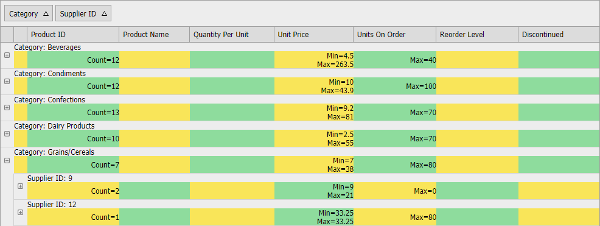

<!-- default badges list -->

[](https://supportcenter.devexpress.com/ticket/details/T197688)
[](https://docs.devexpress.com/GeneralInformation/403183)
<!-- default badges end -->
# Grid View for ASP.NET Web Forms - How to display group summary in group headers
<!-- run online -->
**[[Run Online]](https://codecentral.devexpress.com/t197688/)**
<!-- run online end -->

[ASPxGridView](https://docs.devexpress.com/AspNet/DevExpress.Web.ASPxGridView) supports group footer summaries out of the box. It may be necessary to display group summaries in column headers separately for every group. This example demonstrates one of the possible solutions.



To implement group header summaries, create the [GridViewTemplates.GroupRowContent](https://docs.devexpress.com/AspNet/DevExpress.Web.GridViewTemplates.GroupRowContent) template. Place an HTML table in the template and assign the CSS classes to its HTML elements. 
  
```cs  
public class GridGroupRowContentTemplate : ITemplate {  
    protected Table MainTable { get; set; }  

    public void InstantiateIn(Control container) {  
        Container = (GridViewGroupRowTemplateContainer)container;  
        CreateGroupRowTable();  
        Container.Controls.Add(MainTable);  
        ApplyStyles();  
    }  
    // ...  
}  
```  
  
```vb  
Public Class GridGroupRowContentTemplate  
    Implements ITemplate  

    Protected Property MainTable() As Table  

    Public Sub InstantiateIn(ByVal container As Control)  
        Container = CType(container, GridViewGroupRowTemplateContainer)  
        CreateGroupRowTable()  
        Container.Controls.Add(MainTable)  
        ApplyStyles()  
    End Sub  
    ' ...  
End Class  
```  

The template consists of two parts: a custom group title and group summaries.

```cs  
protected void CreateGroupRowTable() {  
    MainTable = new Table();  
    GroupTextRow = CreateRow();  
    SummaryTextRow = CreateRow();  
    CreateGroupTextCell();  
    CreateIndentCells();  
    foreach(var column in VisibleColumns)  
        CreateSummaryTextCell(column);  
}  
```  

```vb  
Protected Sub CreateGroupRowTable()  
    MainTable = New Table()  
    GroupTextRow = CreateRow()  
    SummaryTextRow = CreateRow()  
    CreateGroupTextCell()  
    CreateIndentCells()  
    For Each column In VisibleColumns  
        CreateSummaryTextCell(column)  
    Next column  
End Sub  
```

The `CreateGroupTextCell` method creates the title.

The `CreateSummaryTextCell` method creates cells for the summary. The number of cells is equal to the total column count. ASPxGridView creates additional indent cells before columns when the data is grouped. When data is grouped by several columns, the total indent count is different in different group rows (deeper child groups have fewer indents. The deepest child has no indent). In this example, the `CreateIndentCells` method generates the correct number of indents depending on the group level.

## Adjust summary cell width on the client

The client `AdjustSummaryTable` method sets the width of summary cells in the following cases:
* Grid is initialized.
* Grid is resized.
* Grid sends a callback.
* A browser window is resized.
  
```js  
function AdjustSummaryTable() {  
    RemoveCustomStyleElement();  
    var styleRules = [ ];  
    var headerRow = GetGridHeaderRow(grid);  
    var headerCells = headerRow.getElementsByClassName("gridHeader");  
    var totalWidth = 0;  
    for(var i = 0; i < headerCells.length; i++)  
        styleRules.push(CreateStyleRule(headerCells[i], i));  
    AppendStyleToHeader(styleRules);  
}  
```  

## CSS resources

This solution contains several static CSS rules (see the [Styles.css](./CS/Styles.css) file). Use the following rules to set the cell background colors or just remove them to get the default background color.  

```css
.summaryTable tr:last-child td:nth-of-type(even) {
    background: #8EDC9D;
}
.summaryTable tr:last-child td:nth-of-type(odd) {
    background: #F9E559;
}
```

## How to integrate this solution to a real project
  

1. Include **GridGroupRowContentTemplate.cs**, **Scripts.js**, and **Styles.css** files in your project.  
2. Assign the `GridGroupRowContentTemplate` class to the [GridViewTemplates.GroupRowContent](https://documentation.devexpress.com/#AspNet/DevExpressWebGridViewTemplates_GroupRowContenttopic) template at runtime:  
  
    ```cs  
    protected void Grid_Init(object sender, EventArgs e) {  
        Grid.Templates.GroupRowContent = new GridGroupRowContentTemplate();  
    }  
    ```  
  
    ```vb  
    Protected Sub Grid_Init(ByVal sender As Object, ByVal e As EventArgs)  
        Grid.Templates.GroupRowContent = New GridGroupRowContentTemplate()  
    End Sub  
    ```  
  
3. Add script and CSS files in your web page:  
  
    ```aspx  
    <head runat="server">  
        <link href="Styles.css" rel="stylesheet" type="text/css" />  
        <script type="text/javascript" src="Scripts.js"></script>  
    </head>  
    ```  
  


## Files to Review

* [GridGroupRowContentTemplate.cs](./CS/App_Code/GridGroupRowContentTemplate.cs) (VB: [GridGroupRowContentTemplate.vb](./VB/App_Code/GridGroupRowContentTemplate.vb))
* [Default.aspx](./CS/Default.aspx) (VB: [Default.aspx](./VB/Default.aspx))
* [Default.aspx.cs](./CS/Default.aspx.cs) (VB: [Default.aspx.vb](./VB/Default.aspx.vb))
* [Scripts.js](./CS/Scripts.js) (VB: [Scripts.js](./VB/Scripts.js))
* [Styles.css](./CS/Styles.css) (VB: [Styles.css](./VB/Styles.css))

## Online Demos

* [Group Footer Summaries](https://demos.devexpress.com/ASPxGridViewDemos/Summary/GroupFooter.aspx)


## Documentation

* [Group Summary](https://docs.devexpress.com/AspNet/3758/components/grid-view/concepts/use-data-summaries/group-summary)


## More Examples

* [Grid View for ASP.NET MVC - How to display group summary in group headers](https://supportcenter.devexpress.com/internal/ticket/details/T446118#)  
